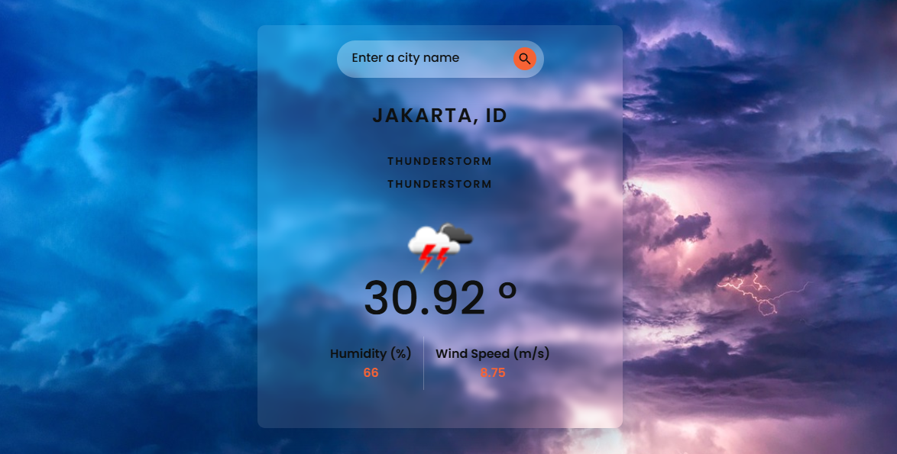
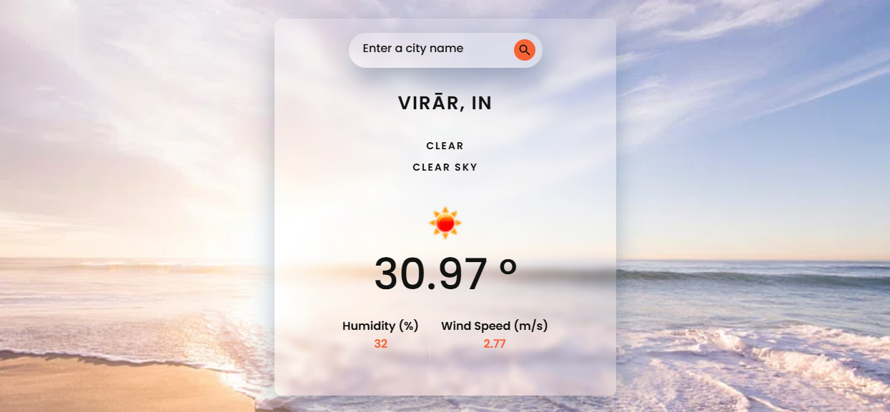
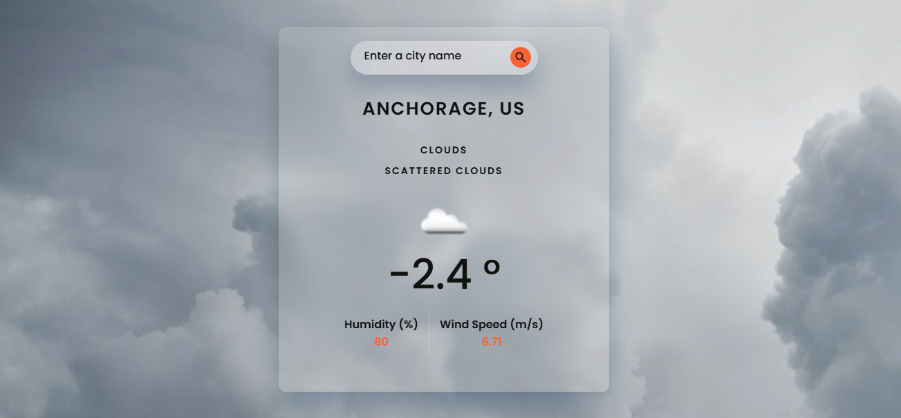
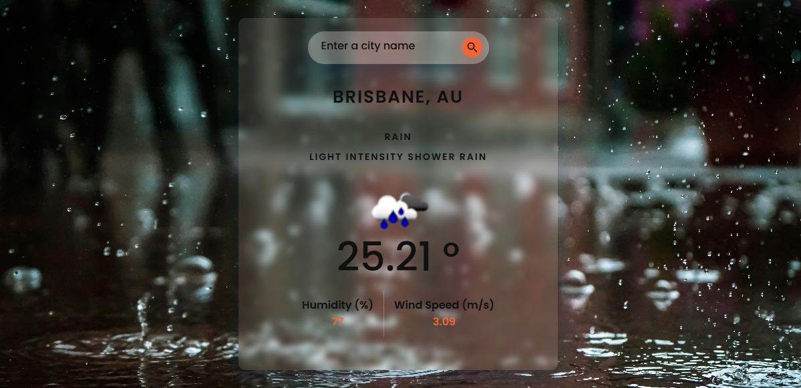

# Forecast

 Weather App built using Vanilla JavaScript and a weather API. The app fetches real-time weather data, including temperature, humidity, wind speed, and other essential metrics. It features a dynamic gradient background that changes based on temperature conditions, providing a visually appealing user experience. The app allows users to search for cities and view weather details with a clean and responsive design.

## Tech Stack

 HTML, CSS, JavaScript, API

 ## Screenshots

  